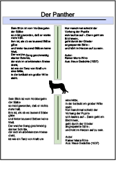
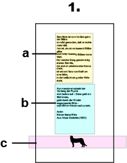

Basic Concepts
==============

The very basic object `crass` operates on is a **page** with **separator
lines**. First the **page** will be cropped into **segments** based on the 
**separator lines** and afterwards spliced together to a new image. 
There must be at least one vertical and one horizontal line that the code 
runs correctly. In an additionally preprocessing step, `crass` might detect
the rotation of the page and will rotating it to the correct angle. 
This process is called **"deskewing"**.

## Input and Output Image Files

`crass` can process either one **page** or a **folder** containing several 
pages with the same extension. The output files will have the same extension 
as the inputs ones.

By default, `crass` places the single segments and the debuginformation-images 
into the directory "out/..".   
The subdirectory "out/spliced/.." will contain the final spliced images. 

### File Formats

The *image-file* format accepted by `crass` is *jpg*.

## Single Steps to Victory

### Deskew
1.  Find the top or bottom horizontal line.
2.  Compute the deskew angle.
3.  Rotate to the correct angle.

### Line Analyse
1. Find the top or bottom horizontal line.
1. Finds all vertical lines in the middle (by default) of the page.

### Crop
1. Compute the clipping masks.
    * There are 5 types of segments:
        - h = header
        - a = left side separated by a vertical line
        - b = right side separated by a vertical line
        - c = space between header and vertical line or vertical line and another vertical line
        - f = footer
2. Crop the single segments 
    (by default: the footer and header information will also be stored)
    

### Splice
1. Splice the single segments according to a certain order.
    (by default, a then b then a ... till a c segments forms the end)
    

You can find more detailed information about the single steps and setting
options in the [image processing][1] documentation.

[1]: image-processing.md